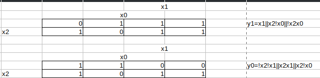

# Вариант 2

Цель работы: Разработать проект комбинационного устройства на основе
программируемой логической интегральной схемы в среде программирования Quartus: приобрести
навыки формирования проекта комбинационного устройства по заданной таблице истинности.

Заданная таблица истинности:

| x2  | x1  | x0  | y1  | y0  |
| --- | --- | --- | --- | --- |
| 0   | 0   | 0   | 0   | 1   |
| 0   | 0   | 1   | 1   | 1   |
| 0   | 1   | 0   | 1   | 0   |
| 0   | 1   | 1   | 1   | 0   |
| 1   | 0   | 0   | 1   | 0   |
| 1   | 0   | 1   | 0   | 1   |
| 1   | 1   | 0   | 1   | 1   |
| 1   | 1   | 1   | 1   | 0   |

Составим диаграммы Вейча на основе таблицы истинности:

После упрощения получаем:

$$

y1 = x1 \lor x2 \oplus x0

$$