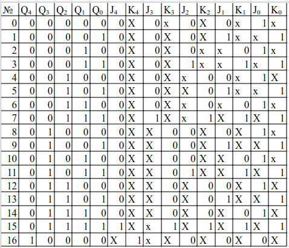
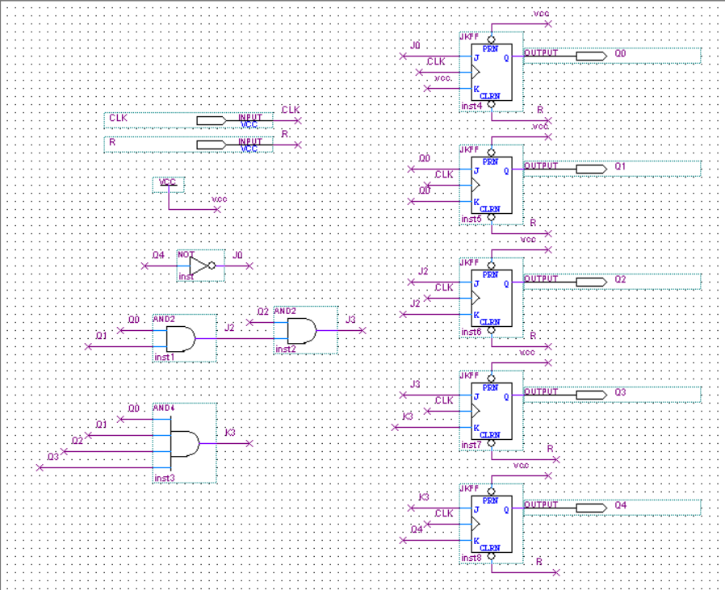
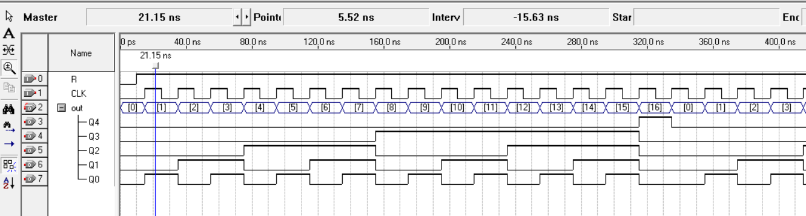

# Цель работы

Разработать проект счетчика с заданным основанием счета на JKтриггерах в среде программирования Quartus, попутно изучив элементы методологии работы с неполностью определенными таблицами истинности. 

# Вариант 2

Основание счёта - 17

# Ход работы

Полученные выражения

$$ J_0 = \bar{Q_4} ; K_0 = 1 ; J_1 = Q_0 ; K_1 = Q_0 $$

$$ J_2 = Q_0 \land Q_1 ; K_2 = Q_0 \land Q_1 = J_2 ; J_3 = Q_0 \land Q_1 \land Q_2 = J_2 \land Q_2 ; K_3 = Q_0 \land Q_1 \land Q_2 \land Q_3 $$

$$ J_4 = Q_0 \land Q_1 \land Q_2 \land Q_3 = K_3 ; K_4 = Q_4 $$

# Вывод

Был разработан проект счетчика с основанием счета 17 на JK-триггерах в среде программирования Quartus, попутно были изучены элементы методологии работы с неполностью определенными таблицами истинности.