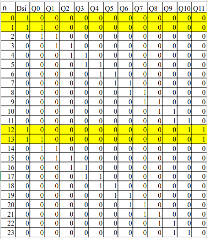
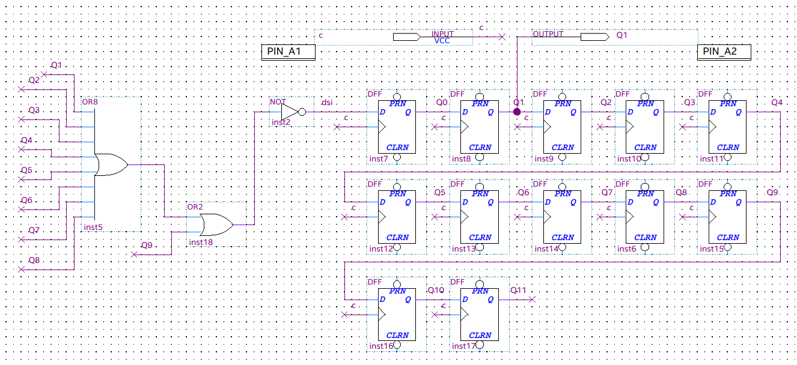
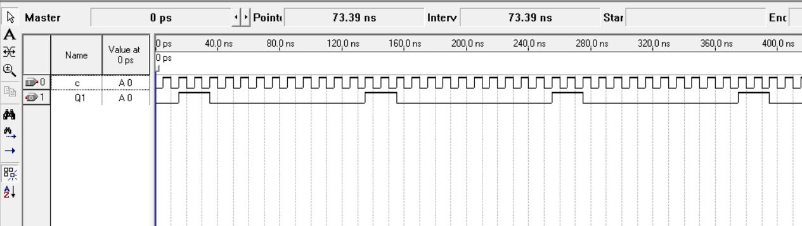
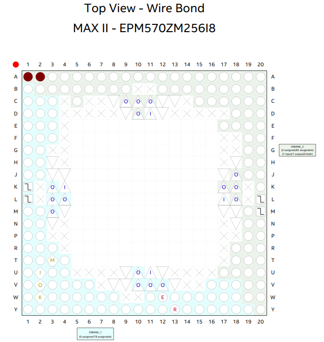

# Цель работы

Разработать проект формирователя импульсной последовательности с заданными свойствами в среде программирования Quartus.

# Индивидуальное задание. Вариант 2

$$ K_{nach} = 1; K_1 = 2; K_0 = 10. $$

# Ход работы

Сперва была построена таблица истинности для 2 состояний

Было составлено логическое выражение:

$$ Dsi = \neg{(Q1 \lor Q2 \lor Q3 \lor Q4 \lor Q5 \lor Q6 \lor Q7 \lor Q8 \lor Q9)}   $$

Затем была собрана схема устройства

# Выводы

Разработан проект формирователя импульсной последовательности с заданными свойствами в среде программирования Quartus на ПЛИС EPM570ZM256I8