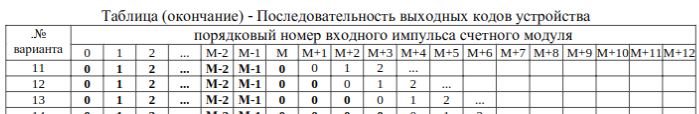
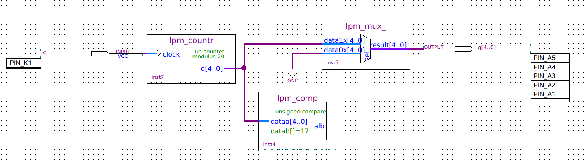
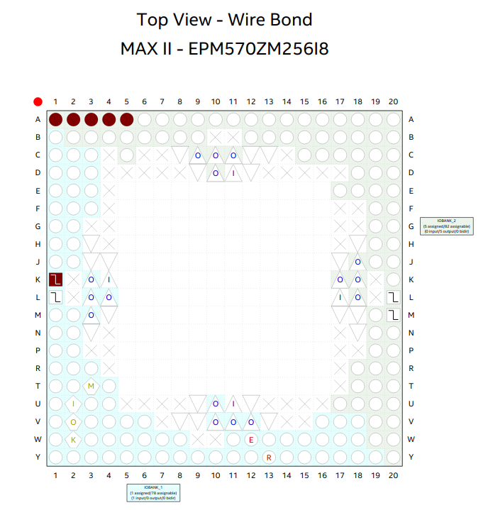
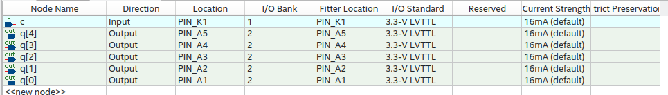

# Цель работы

Разработать проект модуля счетного устройства, работающего по заданному алгоритму, в среде программирования Quartus.

# Индивидуальное задание. Вариант 13

Основание счётчика - 17

# Решение

Сперва выходной сигнал с нулевого до 16-го такта возрастает от 0 до 
16, затем выходной сигнал равен нулю на протяжении 4-х тактов. Для реализации была построена схема с использованием одного счётчика и одного компаратора.

Счётчик по модулю 20 отсчитывает номера тактов, а компаратор сравнивает текущее значение счётчика с константой 17. Если номер такта меньше 17, компаратор выдает единицу, иначе – ноль. Затем значение счётчика побитово умножается на значение компаратора.

# Вывод 

Был разработан  проект модуля счетного устройства, работающего по заданному алгоритму. 