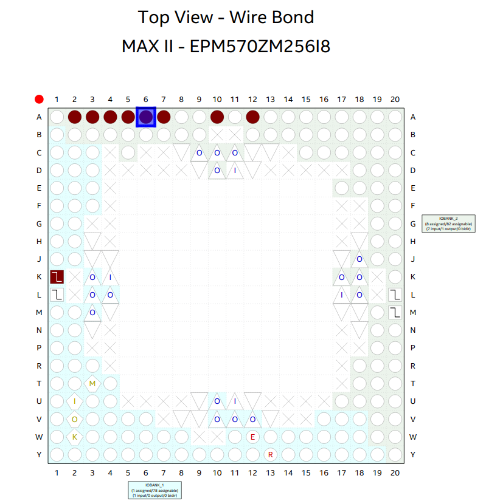

# Цель работы

Разработать проект формирователя импульсов, параметры которых задаются внешним двоичным параллельным кодом, в среде программирования Quartus.

# Вариант 2

$$ K_1 = 1 $$
$$ K_0 = N $$

# Решение

Полученное в n число мы передаём в д-триггер, который обновляет своё значение, когда подан загрузочный сигнал.

Далее от д-триггера значение инкрементируется (чтобы получить период сигнала) и идёт в счётчик, который сбрасывается до поданного n+1 в случае, если на загрузочный сигнал подаётся логическая 1 или значение счётчика доходит до 1, о чем мы узнаем от компаратора 0, который слушает выход со счётчика и сравнивает его с единицей.

Далее выход со счётчика вместе со значением из д-триггера идёт в компаратор1, который сравнивает два значения и кладёт на выход 1, если значение счётчика больше значения n.

Таким образом, когда мы задаём значение n и подаём сигнал загрузки, счётчик устанавливает значение в n+1, а на выход идёт 1 (n+1 > n), после чего 3 такта, которые счётчик опускается до 1, мы на выходе видим 0. 

# Вывод

Был разработан проект формирователя импульсов, параметры которых задаются внешним двоичным параллельным кодом, в среде программирования Quartus.